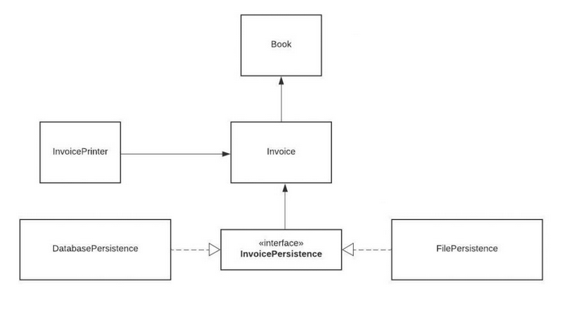
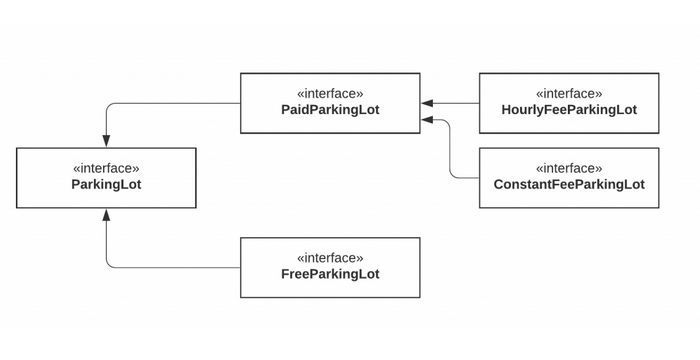

= 2022-02-27_solidTypescript

== SOLID

=== THEORY

a new principe I have to find out.
https://www.freecodecamp.org/news/solid-principles-explained-in-plain-english/

==== SINGLE RESPONSIBILITY PRINCIPLE (SRP):
*A class should only have a single responsibility*, a class should do one thing and therefore it should have only
a single reason to change.
Only one potential change (database logic, logging logic, and so on.) in the software’s specification should be able to
affect the specification of the class.

====== definition SRP
  -  a class can only have 1 responsibility
  -  if you explain what a class does, and you use the word and, there is more than 1 responsibility
  -  if a class follows SRP, you can't think of more than one reason for that class to change
  -  a class should do one thing, and therefore it should have only a single reason to change.

==== OPEN-CLOSED PRINCIPLE:
*Classes and other entities should be open for extension but closed for modification.*
So what this principle wants to say is: We should be able to add new functionality without touching the existing code for the class.
This is because whenever we modify the existing code, we are taking the risk of creating potential bugs.
So we should avoid touching the tested and reliable (mostly) production code if possible.

===== For this part, we have to use 'extend' and 'implement'
  - Implement (used for polymorphism): Whenever we want to say that an object being passed has a specific set of attributes,
    we can use an interface.
    A class can implement more than one interface, which have their own attributes and/or (empty)methods .
    Each class that implements a particular interface with a method, is required to write out a specific code for this methods.
    NOTE: all attributes of an interface are public!
  - Extend (to profit from inheritance): A class can only extend (subclass) one parent.
    The extends keyword is used in class declarations or class expressions to create a class that is a child of another class.
    The child class inherits all properties and methods from the parent class, it can override some of these and implement new ones,
    but the parent stuff is already included.

==== LISKOV SUBSTITUTION PRINCIPLE:
*Objects should be replaceable by their subtypes.See also design by contract. = polymorphism*
This means that, given that class B is a subclass of class A, we should be able to pass an object of class B
to any method that expects an object of class A and the method should not give any weird output in that case.

This is the expected behavior, because when we use inheritance we assume that the child class inherits everything
that the superclass has.
The child class extends the behavior but never narrows it down.

Therefore, when a class does not obey this principle, it leads to some nasty bugs that are hard to detect.

==== INTERFACE SEGREGATION PRINCIPLE:
*Interfaces should be client specific rather than general.*
Segregation means keeping things separated, and the Interface Segregation Principle is about separating the interfaces;
no code should be forced to depend on methods it does not use.
Interfaces that are very large needs to be split into smaller and more specific ones so that clients will only have
to know about the methods that are of interest to them.
Similar to the Single Responsibility Principle, the goal of the Interface Segregation Principle is to reduce
the side effects and frequency of required changes by splitting the software into multiple, independent parts.
By following this principle, you prevent bloated interfaces that define methods for multiple responsibilities.

==== DEPENDENCY INVERSION PRINCIPLE:
*Depend on abstractions rather than concretions.*
Entities must depend on abstractions not on concretions. It states that the high level module must not depend on
the low level module, but they should depend on abstractions.

This principle states that a class should not depend on another class, but instead on an abstraction of that class.
It allows loose-coupling and more reusability.

=== EXERCISES
==== 0.S
The Car class contains too much information and functions.
It is better to put this data in separate classes (radio and engine).
The properties must then be created and called in the Car class (get fuel, get radio).

The 'oldradiolevel' is set equal to the 'radiolevel', the 'new' value is set equal to 'radiolevel'

Because certain sentences are repeated, it is best to make a const of this. If you then want to change the text,
you only have to do this in 1 place. (turn music on/of)

==== 1.O
I made the function 'makeSound' dependent on the animal instead of the zoo.
Because all animal classes were so similar, I made a new class (Anima) to which you pass what type of animal it is.
I don't know if it's supposed to be that way, but this seems the most logical to me...
It was not the right solution, so I had to change it. I created an interface 'CanMakeSound'
and implemented it into the other classes.

==== 2.L
I made a class for each type of discount, witch implement an interface (DiscountType) who has two functions,
so all the discounts types have their own method for this.
I wasn't sure if no-discount needed a unique class, as there is no discount, but to keep things equal,
a class is provided for this too.

==== 3.I
I have created 3 interfaces to login, each with their own methods (set token and check login).
The users class implements them all 3, the admin only implements the interface to log in with a password.
Because the Bot can only log in with Google, I only implement this interface.

When checking if you are admin or guest, I changed the code a bit.
If the  'Login as admin' checkbox is not checked, you are a guest, and I only check the login for guest.
If the box is checked, I check the login for admin.

==== 4.I
The Restaurant class depends on usage of its Oven object.
What if we wanted to make a restaurant that uses a different kind of cooking instrument?
I made an interface Oven, made 2 classes instead of one, and let the restaurant have its own oven.

What if I want to make an ice-cream Parlour?  I changed the interface into a KitchenAppliance
and made the function names more general.
Now I have my ice-cream Parlour :-)

